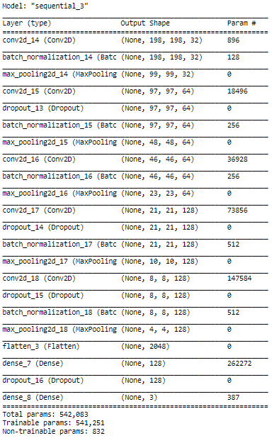
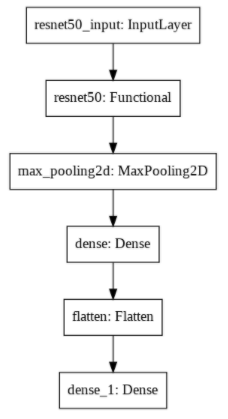

# ANNEXURE - MODEL DETAILS

## Model 1: Basic Model-A

## Model 2: Basic Model-B

## Model 3: Basic Model-C

## Model 4: Basic Model-D

## Model 5: VGG-16-A

## Model 6: VGG-16-B

## Model 7: VGG-16-B

## Model 8: Resnet-A

## Model 9: Resnet-B
